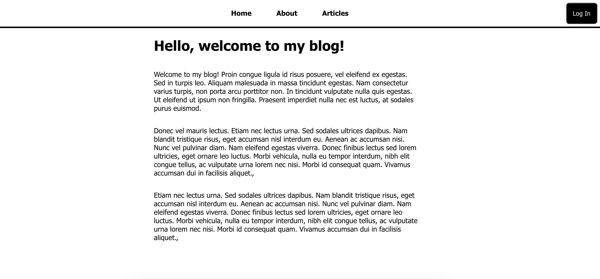
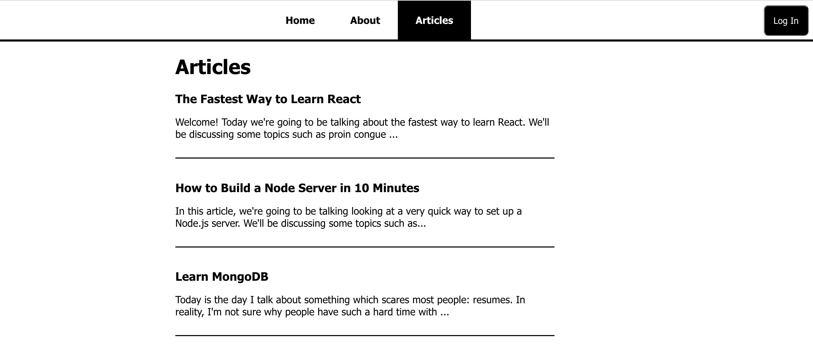
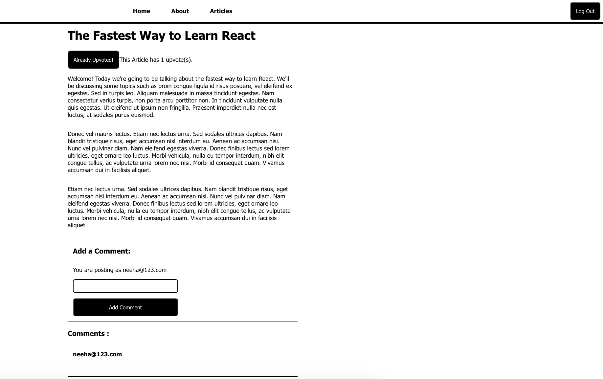
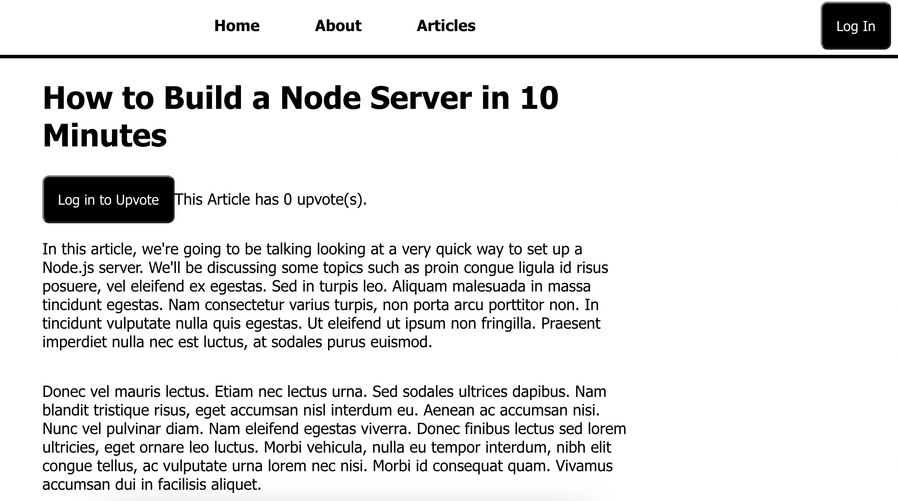
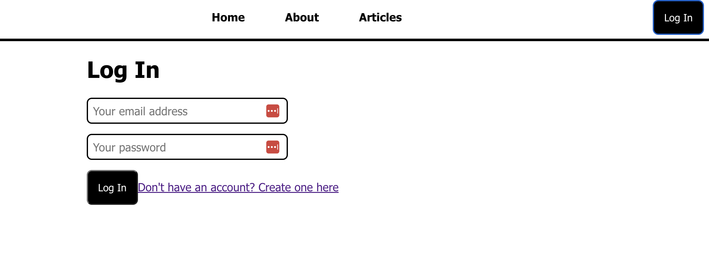
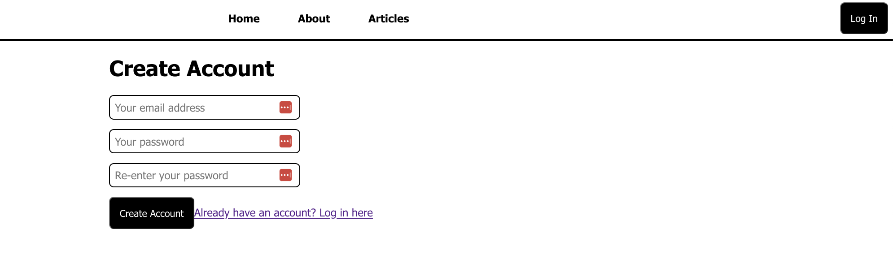
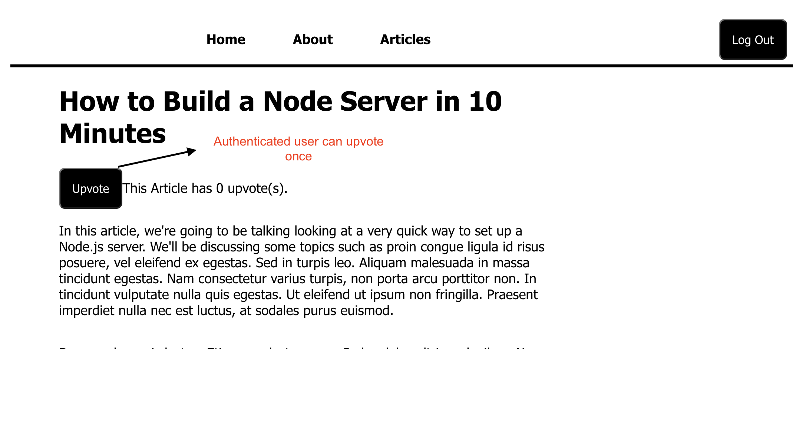
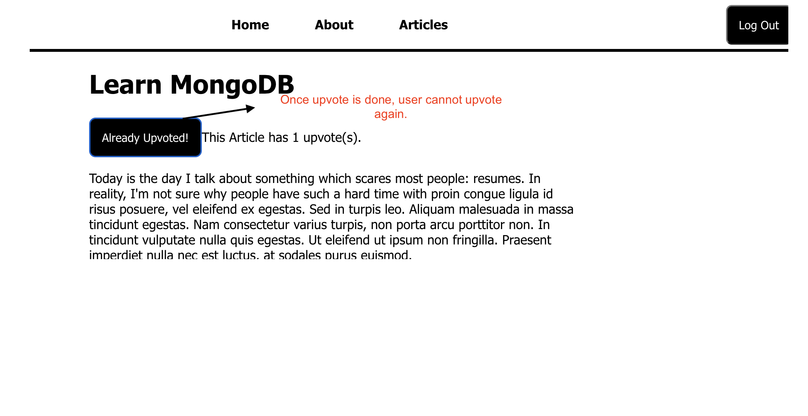

<h1>About </h1>
<b>Article_vote</b> is an app where you load and display the articles along with "Home" and  "About" navigation tabs using React-Router.

  
<b>React, NodeJs, MongoDb, MongoDb Atlas, firebase authentication, axios, React hooks, CSS, HTML, Javascript</b>
<h1>Look and Feel</h1>
<h3>Home/About </h3> 
Both Home and About pages have same views displaying static content.

<h3>Articles </h3> 
Load and display all articles with each article truncated to fixed number of characters. These articles can be viewed by all.

<h3>Single Article</h3> 
When clicked on any single article, a full view of complete article is displayed. It shows total number of upvotes so far for the article on top and all comments below the article. Only authenticated users can upvote an article (only once) and share comments.

    
If the user didn't login, the article will have an option to ask user to login if want to upvote/ comment on article

    

<h3>Login/ Create account.</h3> 
In order to upvote/comment on article, a user has to login if already have an account or create a new one if its a new user.

<h3>Upvote</h3> 
Shows whether user had upvoted or not.

